# Michelin - Plan d'édition de la présentation

Ce fichier Markdown sert de source de travail pour la présentation PowerPoint actuelle :

- Modèle Excel: `excel_model/Michelin_valuation_model.xlsx`
- Équipe: Milo Cardona; Alexandre Delattre
- Objectif: determiner le contenu ici d'abord, puis creer le PowerPoint.
- Structure: ordre aligné sur `consigne.md`.

---

# Slide 1 - Executive Summary

**Sous-titre:** résumé des principales informations du travail, données au 20 avril 2026

## Indicateurs clés

| Indicateur | Valeur |
|---|---:|
| CA 2025 | EUR 26.0 Md |
| Marge EBIT SECTOR MICHELIN | 10.5% |
| FCF 2025 | EUR 2.2 Md |
| Valeur DCF / action | EUR 44.5 |
| Objectif central | EUR 40.3/action |
| Rendement total estimé | 29.2% |
| Recommandation | Acheter |

## Thèse d'investissement

- Michelin est un leader mondial premium du pneu, avec une exposition importante au remplacement, plus résilient que la première monte.
- Les deux grands canaux de revenus pneus sont **OE / première monte** et **remplacement / aftermarket**: OE correspond aux pneus vendus aux constructeurs pour les véhicules neufs; le remplacement correspond aux pneus vendus pour remplacer des pneus usés sur le parc roulant existant.
- Le marché reste mature mais soutenu par la premiumisation, les pneus 18 pouces et plus, les véhicules électriques, les flottes et les spécialités.
- La faiblesse 2025 vient surtout des volumes et des devises; le price-mix reste positif, ce qui montre que le pouvoir de prix n'est pas cassé.
- La thèse repose sur une normalisation progressive des marges, une forte génération de FCF et un bilan solide.

## Lecture financière et valorisation

- Le scénario central retient une reprise prudente: croissance modérée du CA et marge EBIT remontant graduellement vers 12.0% en 2030.
- Les comparables donnent une valeur de contrôle proche de EUR 36/action, sans signal de survalorisation évidente.
- Le DCF donne EUR 44.5/action, soutenu par les FCFF explicites et la valeur terminale.
- L'objectif retenu de EUR 40.3/action implique 24.9% de potentiel cours et 29.2% de rendement total avec dividende.

## Catalyseurs et risques

- Catalyseurs: reprise des volumes, maintien du price-mix positif, spécialités, premiumisation et rachats d'actions 2026-2028.
- Risques: faiblesse durable en première monte, pression des pneus d'entrée de gamme, matières premières, change EUR/USD et sous-utilisation industrielle.
- Conclusion: Acheter, car le rendement total attendu dépasse largement le coût des fonds propres et le scénario central reste prudent.

**Sources:** résultats annuels Michelin 2025, chiffres clés 2020-2025, StockAnalysis, Kroll, CountryEconomy.

---

# Slide 2 - Analyse du marché - Taille du marché adressable et segmentation

**Sous-titre:** Un marché mondial important, tiré par le remplacement et le premium

## Indicateurs clés

| Indicateur | Valeur |
|---|---:|
| Marché pneus 2025 | USD 147.4 Md |
| Canal le plus résilient | Remplacement |

## Méthode de détermination du marché

- La taille de marché vient de Grand View Research, qui estime le marché mondial des pneus à USD 147.44 Md en 2025; le périmètre couvre les ventes OEM / première monte et remplacement.
- Les données de volumes par segment viennent du fichier officiel des chiffres clés Michelin 2020-2025; elles servent à expliquer la structure physique du marché, pas à recalculer le marché en dollars.
- Les volumes PLT et Truck sont exprimés en **millions de pneus vendus dans le marché mondial**, additionnés entre les régions publiées par Michelin; ce ne sont pas des revenus et ce n'est pas une part de marché Michelin.

## Segments de marché 2025

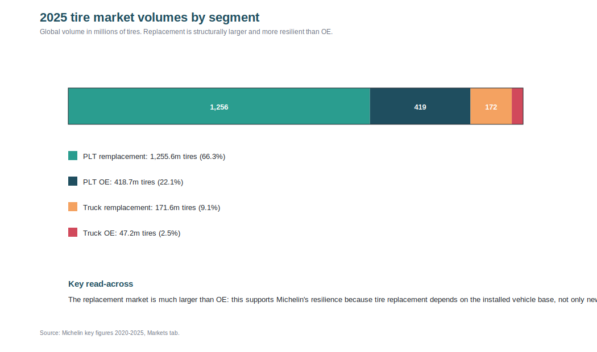

| Segment | Volume de marché 2025 |
|---|---:|
| PLT remplacement | 1,255.6 millions de pneus |
| PLT OE | 418.7 millions de pneus |
| Truck remplacement | 171.6 millions de pneus |
| Truck OE | 47.2 millions de pneus |

## Interprétation

- **PLT** signifie pneus pour voitures particulières et utilitaires légers.
- **OE / première monte** correspond aux pneus vendus aux constructeurs pour véhicules neufs.
- **Remplacement / aftermarket** correspond aux pneus vendus pour remplacer des pneus usés sur le parc roulant existant.
- Le remplacement est plus stable que la première monte car il dépend du parc roulant existant, du kilométrage et des exigences de sécurité.
- La première monte dépend davantage de la production de véhicules neufs, donc elle est plus cyclique.
- Le premium tire la valeur: pneus plus grands, plus techniques, plus chers et souvent plus rentables.
- Le remplacement est plus résilient parce que les conducteurs doivent changer leurs pneus même lorsque les ventes de voitures neuves ralentissent; la demande dépend surtout de l'usure, du parc installé et des kilomètres parcourus.

**Sources:** Grand View Research; chiffres clés Michelin 2020-2025, onglet marchés.

---

# Slide 3 - Analyse du marché - Panorama concurrentiel + barrières à l'entrée

**Sous-titre:** Un secteur mondial concentré sur les marques premium, avec des concurrents asiatiques

## Panorama concurrentiel

| Concurrent | Positionnement |
|---|---|
| Bridgestone | Leader mondial, pneus et solutions |
| Michelin | Premium, innovation, spécialités |
| Goodyear | Pneus purs, exposition US forte |
| Continental | Équipementier auto diversifié |
| Pirelli | Premium grand public et performance |
| Yokohama / Hankook | Acteurs asiatiques en montée |

## Barrières à l'entrée

- Barrières à l'entrée: marque, réseau de distribution, relations OEM, certification, R&D et capital industriel.
- La performance sécurité, bruit, efficience énergétique et durabilité impose des investissements continus.
- Le risque concurrentiel vient surtout des pneus d'entrée de gamme importés et de la pression prix en remplacement.
- Michelin défend ses marges via mix premium, innovation produit, spécialités et discipline prix.
- Le **moat** de Michelin vient de la combinaison marque premium, savoir-faire R&D, réseau de distribution, homologations constructeurs et capacité industrielle mondiale.
- Ce moat est plus fort dans le premium et les spécialités que dans les pneus d'entrée de gamme, ou la concurrence par les prix est plus intense.

**Sources:** Michelin URD 2025; StockAnalysis comparables; analyse interne.
---

# Slide 4 - Analyse du marché - Croissance historique + croissance anticipée & moteurs / risques

**Sous-titre:** La première monte est plus cyclique; le remplacement soutient la résilience du marché

## Croissance des volumes de marché par canal

Le graphique ci-dessous montre la croissance annuelle des **volumes de marché**, pas la croissance du chiffre d'affaires Michelin. Les volumes 2021-2025 viennent du fichier Michelin des chiffres clés, onglet Markets. La barre épaisse **Total PLT + Truck** est calculée en additionnant les volumes de chaque canal avant de calculer la croissance: elle est donc pondérée par la taille réelle des canaux en volumes. Les spécialités ne sont pas incluses faute de série comparable par canal.

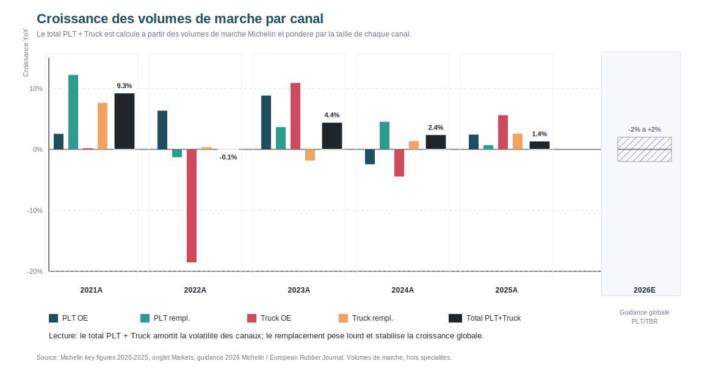

## Croissance anticipée du marché (Grand View Research)

| Indicateur | Valeur / Croissance |
|---|---:|
| Prévision marché mondial 2030 | USD 173.9 Md |
| CAGR anticipé 2025-2030 | 3.4% |

## Données clés 2025 et guidance 2026 (Michelin)

| Marché 2025 | Croissance |
|---|---:|
| PLT première monte global | +2% |
| PLT remplacement global | +1% |
| Truck OE global | +6% |
| Truck remplacement global | +3% |
| Total PLT + Truck, hors spécialités | +1.4% |
| Indications marché 2026 Michelin | PLT/TBR -2% à +2% |

## Lecture

- La première monte est plus cyclique car elle dépend directement de la production de véhicules neufs; cela se voit surtout sur le Truck OE, très volatil entre 2021 et 2025.
- Le remplacement est plus stable car il dépend du parc roulant existant, de l'usure des pneus et du kilométrage.
- La barre épaisse du total montre la croissance globale pondérée par volumes: malgré la volatilité de certains canaux, le marché PLT + Truck progresse de **+1.4%** en 2025.
- La guidance 2026 de -2% à +2% confirme une approche prudente: Michelin ne construit pas son discours sur une forte accélération du marché.
- Cette lecture soutient notre thèse: la croissance brute est limitée, donc la valeur vient surtout du mix, de la marge et de la discipline prix.

## Moteurs de croissance qualitatifs

- Premiumisation: les clients paient davantage pour la sécurité, la performance, la longévité et les marques reconnues, ce qui soutient le prix moyen.
- Pneus 18 pouces et plus: les SUV, véhicules premium et véhicules électriques utilisent plus souvent des pneus de grande taille; ils sont plus techniques, plus chers et généralement plus margés.
- Électrification: les véhicules électriques sont plus lourds, ont un couple instantané plus élevé et exigent moins de bruit de roulement, ce qui crée une demande pour des pneus spécifiques.
- Efficience énergétique: les constructeurs et les consommateurs cherchent des pneus à faible résistance au roulement pour réduire consommation, émissions ou perte d'autonomie.
- Flottes connectées: les transporteurs veulent optimiser coût au kilomètre, maintenance prédictive et disponibilité des véhicules, ce qui valorise les offres de services.
- Spécialités: mines, aviation, agricole et deux-roues ont des exigences techniques élevées et une concurrence moins commoditisée.

## Risques

- Faiblesse auto/camion: moins de production de véhicules neufs réduit les volumes en première monte et pèse sur l'utilisation des usines.
- Matières premières: caoutchouc naturel, caoutchouc synthétique, noir de carbone, énergie et transport peuvent comprimer les marges si Michelin ne passe pas les hausses en prix.
- Change EUR/USD: Michelin vend et produit globalement; les variations de change peuvent affecter le chiffre d'affaires publié et les marges par région.
- Importations asiatiques: les pneus d'entrée de gamme peuvent accentuer la pression prix sur le remplacement, surtout dans les segments les moins différenciés.
- Droits de douane: les mesures commerciales peuvent perturber les flux d'import/export, les coûts d'approvisionnement et la compétitivité locale.
- Sous-utilisation des usines: en cas de baisse des volumes, les coûts fixes industriels sont absorbés par moins d'unités, ce qui pèse sur la marge EBIT.

## Hypothèse centrale

- Reprise graduelle, sans accélération macro agressive.

**Sources:** chiffres clés Michelin 2020-2025, onglet Markets; résultats annuels Michelin 2025; tendances de marché Michelin; European Rubber Journal.

---

# Slide 5 - Analyse de l'entreprise - Activité + actionnariat + Top Management

**Sous-titre:** Michelin combine pneus, composites, solutions connectées et expériences de marque

## Indicateurs clés

| Indicateur | Valeur |
|---|---:|
| Employés ETP | 115,800 |
| Sites pneus | 75 |
| Institutions | 48.8% |
| Actionnaires individuels | >250k |

## Segments 2025

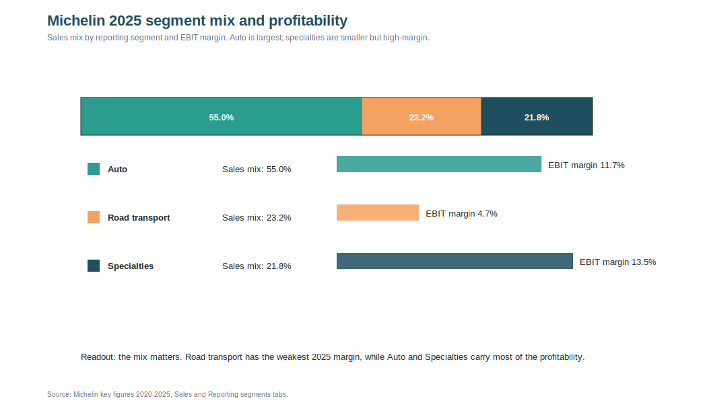

| Segment 2025 | CA 2025 | EBIT SECTOR MICHELIN | Marge |
|---|---:|---:|---:|
| Auto et distribution | EUR 14.3 Md | EUR 1.7 Md | 11.7% |
| Transport routier | EUR 6.0 Md | EUR 0.3 Md | 4.7% |
| Spécialités | EUR 5.7 Md | EUR 0.8 Md | 13.5% |

## Lecture des segments

- Auto et distribution reste le principal moteur de CA du groupe, avec plus de la moitié des ventes 2025.
- Les Spécialités ont la meilleure marge, ce qui soutient la thèse d'un mix plus qualitatif et moins commoditisé.
- Transport routier est le point faible 2025: la marge de 4.7% reflète la faiblesse camion, la sous-utilisation et un environnement plus cyclique.
- L'actionnariat combine une base institutionnelle significative et plus de 250k actionnaires individuels, ce qui renforce la liquidité et la visibilité boursière du dossier.

## Direction et stratégie

- Direction actuelle: Florent Menegaux, Président de la Gérance et Associé Commandité; Yves Chapot, Gérant non Commandité.
- Transition proposée: Philippe Jacquin est proposé comme futur Gérant non Commandité à l'AG du 22 mai 2026.
- Lecture: management stable, avec une transition organisée et sans rupture stratégique évidente.
- Stratégie: valeur plutôt que volume, position de leader de la marque MICHELIN, spécialités et solutions de composites polymères.

**Sources:** pages de gouvernance Michelin, fichier des chiffres clés, StockAnalysis.

---

# Slide 6 - Analyse de l'entreprise - Analyse du P&L historique

**Sous-titre:** Recul des ventes 2024-2025, mais flux de trésorerie et bilan solides

## Historique financier

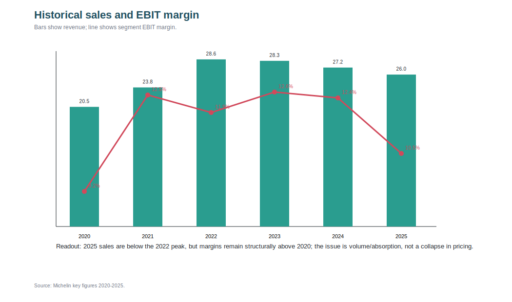

| EURm | 2020 | 2021 | 2022 | 2023 | 2024 | 2025 |
|---|---:|---:|---:|---:|---:|---:|
| CA | 20,469 | 23,795 | 28,590 | 28,343 | 27,193 | 25,992 |
| Croissance | -15.2% | 16.3% | 20.2% | -0.9% | -4.1% | -4.4% |
| Marge EBIT SECTOR MICHELIN | 9.2% | 12.5% | 11.9% | 12.6% | 12.4% | 10.5% |
| Résultat net | 625 | 1,845 | 2,009 | 1,983 | 1,890 | 1,664 |
| FCF | 2,004 | 1,357 | -180 | 2,343 | 2,225 | 2,181 |

## Décomposition du P&L 2025

Le waterfall ci-dessous part de 100% du CA 2025 et soustrait les principaux postes de coûts publiés par Michelin pour arriver à la marge EBIT SECTOR MICHELIN de 10.5%. Il explique le **niveau** de marge 2025; le bridge de la slide suivante explique ensuite le mouvement du CA 2024-2025.

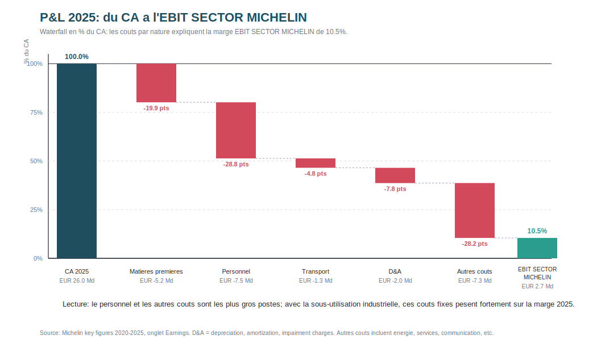

**Note méthodologique:** EBIT SECTOR MICHELIN = résultat opérationnel récurrent publié par Michelin pour ses segments. Il est différent de l'EBIT comptable total et de l'EBITDA, mais c'est l'indicateur utilisé par Michelin pour analyser sa marge opérationnelle.

## Lecture du P&L

- 2020-2022: forte reprise post-Covid, avec un CA qui remonte de EUR 20.5 Md à EUR 28.6 Md.
- 2023-2024: CA sous pression, mais marge EBIT SECTOR MICHELIN encore solide autour de 12%.
- 2025: CA EUR 26.0 Md, en baisse de 4.4% à change courant; la faiblesse vient surtout des volumes et des devises, pas d'un effondrement du prix.
- FCF reste supérieur à EUR 2.1 Md en 2024-2025, ce qui montre que la dégradation du P&L ne se transforme pas en crise de trésorerie.

## Pourquoi la marge baisse en 2025 ?

- La marge EBIT SECTOR MICHELIN passe de **12.4% en 2024 à 10.5% en 2025**, soit une baisse de 1.9 point.
- Moins de volumes signifie moins d'absorption des coûts fixes industriels: les usines tournent moins, mais une partie importante des coûts reste fixe.
- La faiblesse vient surtout de la première monte camion et agricole en Amérique du Nord, segments plus cycliques et sensibles à la production de véhicules neufs.
- Les devises défavorables pèsent aussi sur le CA publié et peuvent réduire les marges une fois les profits hors zone euro convertis en EUR.
- Le price-mix reste positif, mais il ne suffit pas à compenser entièrement la baisse des volumes, les devises et la sous-utilisation industrielle.

**Sources:** chiffres clés Michelin 2020-2025, onglets Key figures et Earnings; guide des résultats annuels Michelin 2025.

---

# Slide 7 - Analyse de l'entreprise - Analyse du P&L historique

**Sous-titre:** Bridge prix / volume / mix 2024-2025 pour expliquer la baisse du CA

## Bridge prix / volume / mix 2024-2025

Le graphique ci-dessous transforme le bridge prix / volume / mix en graphique en cascade pour montrer visuellement ce qui explique la baisse du CA 2025.

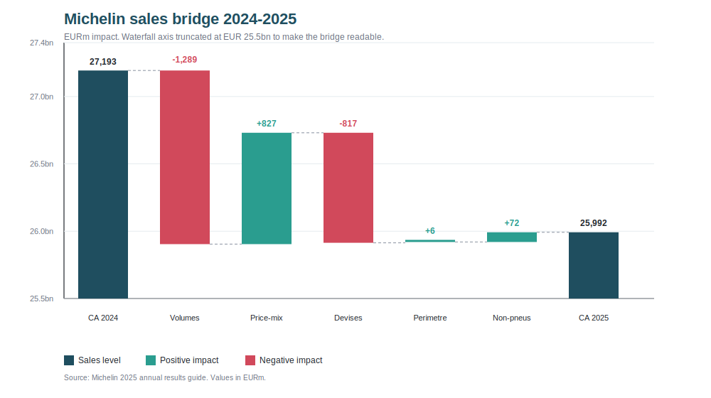

| Élément du bridge | Impact EURm | Impact % vs CA 2024 | Interprétation |
|---|---:|---:|---|
| CA 2024 | 27,193 | - | Point de départ |
| Volumes pneus | -1,289 | -4.7% | Baisse de la demande OE, surtout camion et agricole en Amérique du Nord |
| Prix-mix pneus | +827 | +3.0% | Discipline prix et meilleur mix: marque MICHELIN, pneus 18 pouces et plus, mix remplacement |
| Effet devises | -817 | -3.0% | Euro plus fort: les ventes réalisées hors zone euro valent moins une fois converties en EUR |
| Périmètre | +6 | 0.0% | Effet mineur de consolidation |
| Ventes non-pneus | +72 | +0.3% | Michelin Connected Fleet, solutions de composites polymères et activités d'expérience de marque contribuent positivement |
| CA 2025 | 25,992 | -4.4% | Chiffre d'affaires publié |

## Pourquoi c'est important

- Le bridge montre que la baisse du CA 2025 ne vient pas d'un problème de prix: les facteurs négatifs sont surtout les **volumes** et les **devises**.
- L'effet **price-mix** positif compense une partie de la baisse, ce qui soutient la thèse que Michelin protège la valeur grâce au positionnement premium.
- Cela justifie aussi l'hypothèse de reprise progressive des marges: si les volumes se normalisent et que le price-mix reste positif, le levier opérationnel devrait s'améliorer.

**Source:** chiffres clés Michelin 2020-2025; guide des résultats annuels Michelin 2025.

---

# Slide 8 - Analyse de l'entreprise - Projection 2026E-2030E

**Sous-titre:** La feuille `Forecast` du classeur Excel sert de référence de vérité pour la projection

## Projection 2026E-2030E

Le tableau ci-dessous reprend les lignes les plus utiles de la feuille `Forecast` du classeur Excel. Le classeur est la référence de vérité: il combine la montée graduelle du CA, l'amélioration des marges, la discipline capex et une variation de BFR limitée.

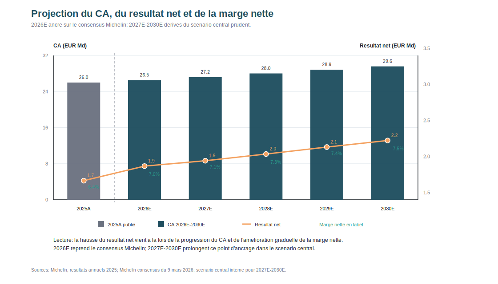

| EURm | 2025A | 2026E | 2027E | 2028E | 2029E | 2030E |
|---|---:|---:|---:|---:|---:|---:|
| CA | 25,992 | 26,382 | 27,042 | 27,853 | 28,688 | 29,406 |
| Croissance CA | -4.4% | 1.5% | 2.5% | 3.0% | 3.0% | 2.5% |
| Marge EBITDA | 17.9% | 18.0% | 18.4% | 18.7% | 18.9% | 19.0% |
| EBITDA | 4,663 | 4,749 | 4,976 | 5,208 | 5,422 | 5,587 |
| Marge EBIT SECTOR MICHELIN | 10.5% | 10.7% | 11.2% | 11.6% | 11.9% | 12.0% |
| EBIT SECTOR MICHELIN | 2,719 | 2,823 | 3,029 | 3,231 | 3,414 | 3,529 |
| FCFF | 2,181 | 2,077 | 2,226 | 2,373 | 2,508 | 2,594 |

## Pont du modèle

- `2026E` est le premier point de projection du modèle Excel.
- `2027E-2030E` prolongent le même scénario avec une croissance du CA modérée, inférieure au marché global, et une normalisation progressive des marges.
- Le `EBITDA` est calculé dans le modèle comme `EBIT SECTOR MICHELIN + D&A`.
- Le `FCFF` reste soutenu parce que le capex et la variation de BFR sont modelisés prudemment.

## Hypothèses du classeur

- La croissance du CA reste prudente: `1.5%` en 2026E, puis `2.5%`, `3.0%`, `3.0%` et `2.5%`.
- La marge EBIT remonte graduellement vers `12.0%` en 2030E, sans expansion agressive.
- Le ratio `D&A / CA` passe de `7.3%` en 2026E à `7.0%` en 2029E-2030E.
- Le ratio `Capex / CA` suit la même trajectoire prudente.
- La variation de BFR reste faible et est liée à `1%` de la croissance incrémentale du CA.

**Sources:** feuille `Forecast` du classeur Excel Michelin; résultats annuels Michelin 2025 publiés le 11 février 2026; consensus sell-side Michelin du 9 mars 2026 conservé comme point de repère externe dans le dossier.

---

# Slide 9 - Valorisation - Comparables : échantillon d'entreprises comparables cotées

**Sous-titre:** Comparables cotés mondiaux de pneumatiques et équipement automobile

## Tableau qualitatif - pourquoi ces sociétés ?

L'échantillon est limité aux groupes cotés qui permettent soit une comparaison **directe** avec Michelin sur le pneu, soit une comparaison **utile mais imparfaite** pour encadrer la valorisation.

| Société | Ticker | Activité principale | Pourquoi retenu | Limite de comparabilité |
|---|---|---|---|---|
| Bridgestone | TYO:5108 | Pneu mondial, tourisme / truck / solutions | Comparable le plus proche: leader mondial, forte exposition remplacement/OE, taille et portefeuille proches | Exposition Japon / Asie plus marquée |
| Goodyear | NASDAQ:GT | Pneu pur, forte exposition US | Pair sectoriel utile car pure player pneu | Levier élevé et marge très faible, donc multiples parfois déformés |
| Continental | ETR:CON | Équipementier auto diversifié avec activité pneus | Référence européenne utile pour le cycle automobile et la lecture du marché | Groupe moins pur pneu que Michelin |
| Pirelli | BIT:PIRC | Pneu premium et performance | Pair clé pour juger la prime de qualité / mix premium | Positionnement plus étroit, moins diversifié que Michelin |
| Yokohama Rubber | TYO:5101 | Pneu et caoutchouc industriel | Pair asiatique pertinent, exposition pneu mondiale et activités industrielles voisines | Poids du caoutchouc industriel |
| Hankook Tire | KRX:161390 | Pneu mondial, bon mix valeur / premium | Pair asiatique global, utile pour cadrer un acteur compétitif à marge correcte | Positionnement plus valeur, profil géographique différent |

## Tableau quantitatif - taille, levier implicite et multiples

| Société | EqV / market cap | EV | EV / EqV | EV / CA | EV / EBITDA | EV / EBIT | EBIT margin |
|---|---:|---:|---:|---:|---:|---:|---:|
| Bridgestone | JPY 4.32T | JPY 4.49T | 1.04x | 1.01x | 5.38x | 9.34x | 10.87% |
| Goodyear | USD 2.06B | USD 8.48B | 4.12x | 0.46x | 6.80x | 23.48x | 1.97% |
| Continental | EUR 13.54B | EUR 19.08B | 1.41x | 0.97x | 6.89x | 12.18x | 7.92% |
| Pirelli | EUR 6.71B | EUR 7.99B | 1.19x | 1.18x | 4.96x | 7.78x | 14.38% |
| Yokohama Rubber | JPY 1.07T | JPY 1.50T | 1.40x | 1.22x | 6.53x | 9.60x | 12.67% |
| Hankook Tire | KRW 7.43T | KRW 12.94T | 1.74x | 0.61x | 4.03x | 7.07x | 8.68% |

## Lecture du tableau

- `EqV / market cap` donne la taille boursière du pair; `EV / EqV` donne une lecture simple du levier implicite ou du poids de la dette / autres ajustements.
- Michelin se situe à `1.11x EV / EqV`, en dessous de la médiane des comparables à `1.41x`, ce qui confirme une structure financière globalement plus légère que plusieurs pairs.
- Bridgestone et Pirelli ressortent comme les comparables les plus "propres": activité très lisible, multiples raisonnables et meilleure qualité opérationnelle.
- Goodyear est maintenu dans l'échantillon parce que c'est un pure player pneu, mais son `EV / EqV` très élevé et sa marge EBIT de `1.97%` montrent bien pourquoi son `EV / EBIT` de `23.48x` doit être interprété avec prudence.
- Continental est utile pour l'ancrage européen, mais son profil diversifié justifie de ne pas le traiter comme un pair aussi pur que Bridgestone ou Pirelli.

**Sources:** StockAnalysis, pages statistiques des comparables, dernier cours disponible au 20 avril 2026 ou à la dernière clôture disponible: [Bridgestone](https://stockanalysis.com/quote/tyo/5108/statistics/), [Goodyear](https://stockanalysis.com/stocks/gt/statistics/), [Continental](https://stockanalysis.com/quote/etr/CON/statistics/), [Pirelli](https://stockanalysis.com/quote/bit/PIRC/statistics/), [Yokohama Rubber](https://stockanalysis.com/quote/tyo/5101/statistics/), [Hankook Tire](https://stockanalysis.com/quote/krx/161390/statistics/).

---

# Slide 10 - Valorisation - Comparables : résultats de la valorisation

**Sous-titre:** La médiane des comparables implique une valeur proche de EUR 36/action

## Indicateurs clés

| Indicateur | Valeur |
|---|---:|
| Prix médian comparables | EUR 36.1 |
| Potentiel vs cours | 11.9% |

## Positionnement actuel de Michelin vs quartiles / médiane

| Multiple | Quartile bas | Médiane | Quartile haut | Michelin actuel |
|---|---:|---:|---:|---:|
| EV / CA | 0.70x | 0.99x | 1.13x | 0.92x |
| EV / EBITDA | 5.06x | 5.88x | 6.73x | 4.96x |
| EV / EBIT | 8.17x | 9.47x | 11.54x | 8.19x |
| EV / EqV | 1.24x | 1.41x | 1.66x | 1.11x |

## Prix implicite par méthode de valorisation

| Méthode | Bas | Médiane | Haut |
|---|---:|---:|---:|
| EV / CA | EUR 23.5 | EUR 36.1 | EUR 40.4 |
| EV / EBITDA | EUR 31.7 | EUR 36.1 | EUR 43.3 |
| EV / EBIT | EUR 30.3 | EUR 36.2 | EUR 44.1 |

## Point de méthode

- Les quartiles et médianes ci-dessus sont calculés sur l'ensemble de l'échantillon de comparables.
- La colonne `Michelin actuel` montre les **multiples de trading actuels de Michelin**, pour pouvoir comparer directement Michelin à la distribution des pairs, et pas seulement aux prix implicites.
- `EV / CA` et `EV / EBIT` de Michelin sont calculés sur la base de l'`EV` actuel de Michelin et des estimations `2026E` retenues sur le slide.
- `EV / EBITDA` de Michelin utilise un `EBITDA 2026E` estimé en interne, car Michelin ne publie pas de consensus EBITDA officiel aussi proprement que pour le `CA` et l'`EBIT SECTOR MICHELIN`.
- La formule retenue est: `EBITDA 2026E = EBIT SECTOR MICHELIN 2026E consensus + D&A 2026E estimés`.
- Les `D&A 2026E` sont estimés comme `CA 2026E consensus x 7.3%`. Le taux de `7.3%` n'est pas arbitraire: il correspond à l'hypothèse `D&A / CA 2026` de notre modèle et reste proche de l'historique récent Michelin, autour de `7.3%` en 2024 et `7.5%` en 2025.
- En chiffres, cela donne environ `EUR 2 982m + (EUR 26 534m x 7.3%) = EUR 4 919m` d'`EBITDA 2026E` pour Michelin.
- `EV / EqV` de Michelin mesure la structure financière actuelle de Michelin et se compare à la médiane des pairs.
- `EV / EqV` apparaît donc dans le tableau de comparaison des multiples, mais **pas** dans le tableau de prix implicite: ce ratio renseigne sur le levier / la structure financière, pas sur une valeur fondamentale à appliquer à Michelin comme `CA`, `EBITDA` ou `EBIT`.
- L'interprétation qualitative donne toutefois plus de poids à Bridgestone et Pirelli, qui sont les comparables les plus propres en termes d'activité et de qualité de marge.
- Michelin traite à **0.92x EV / CA** contre une médiane de **0.99x**, à **8.19x EV / EBIT** contre **9.47x**, et à **1.11x EV / EqV** contre **1.41x** pour la médiane des pairs: cela suggère un profil plutôt conservateur en valorisation et en structure financière.
- Les comparables montrent donc que Michelin n'est **pas cher** par rapport à ses pairs, mais ils n'impliquent qu'un upside relatif **modéré**. Autrement dit, Michelin apparaît légèrement sous-valorisé vs pairs, sans décote spectaculaire.
- La conclusion importante est que les multiples du secteur semblent eux-mêmes **comprimés / cycliques**, ce qui limite ce que les comparables seuls peuvent montrer. Le principal potentiel ressort donc du DCF et de la normalisation des marges plus que d'une forte décote relative vis-à-vis des pairs.
- Goodyear reste utile pour l'univers sectoriel, mais son multiple `EV / EBIT` est clairement gonflé par une marge EBIT anormalement faible.

**Source:** StockAnalysis, statistiques de valorisation des comparables; consensus Michelin 2026E pour le CA et l'EBIT SECTOR MICHELIN; estimation interne de l'EBITDA 2026E de Michelin.

---

# Slide 11 - Valorisation - Comparables : résultats de la valorisation

**Sous-titre:** Analyses complémentaires par régression des multiples et rendement FCF

## Régression des multiples des comparables

Le graphique ci-dessous transforme les comparables en nuage de points avec ligne de régression pour tester si la marge EBIT explique le multiple EV/EBIT.

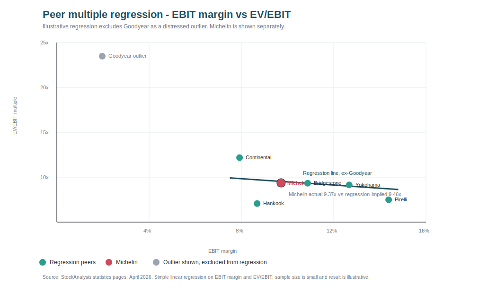

### Méthode

- Objectif: vérifier si la valorisation par comparables est cohérente avec la qualité opérationnelle des comparables.
- Axe X: marge EBIT, utilisée comme proxy simple de profitabilité et qualité opérationnelle.
- Axe Y: EV/EBIT, multiple de valorisation appliqué au résultat opérationnel.
- Goodyear est affiché mais exclu de la régression car sa marge EBIT très faible gonfle mécaniquement son EV/EBIT et rend le point peu comparable.
- Michelin est ajouté comme point de contrôle: on compare son multiple réel à son multiple "théorique" donné par la ligne de régression.

| Société | Marge EBIT | EV/EBIT | Traitement |
|---|---:|---:|---|
| Bridgestone | 10.9% | 9.33x | Régression des comparables |
| Continental | 7.9% | 12.18x | Régression des comparables |
| Pirelli | 14.4% | 7.49x | Régression des comparables |
| Yokohama Rubber | 12.7% | 9.14x | Régression des comparables |
| Hankook Tire | 8.7% | 7.07x | Régression des comparables |
| Goodyear | 2.0% | 23.48x | Valeur aberrante affichée, exclue |
| Michelin | 9.7% | 9.37x | Point testé |

### Résultat

- La régression hors Goodyear donne pour Michelin un multiple théorique d'environ **9.46x EV/EBIT**.
- Michelin se traite à environ **9.37x EV/EBIT**, donc quasiment en ligne avec la valorisation impliquée par sa marge EBIT.
- Conclusion importante: la régression ne prouve pas à elle seule une forte sous-valorisation de Michelin, mais elle montre que Michelin n'est pas cher par rapport à sa rentabilité.
- Cela rend la valorisation plus robuste: la recommandation Acheter repose surtout sur le DCF, les scénarios et la reprise des marges, tandis que les comparables confirment que le multiple actuel n'est pas excessif.

### Message possible pour la diapositive

> Michelin se traite globalement en ligne avec la tendance EV/EBIT ajustée de la qualité des comparables, malgré une marque plus forte et un risque de bilan plus faible que plusieurs pairs. Les comparables ne montrent pas de survalorisation évidente; le potentiel de hausse vient surtout du DCF, de la reprise des marges et de la génération de trésorerie.

## Rendement FCF vs comparables

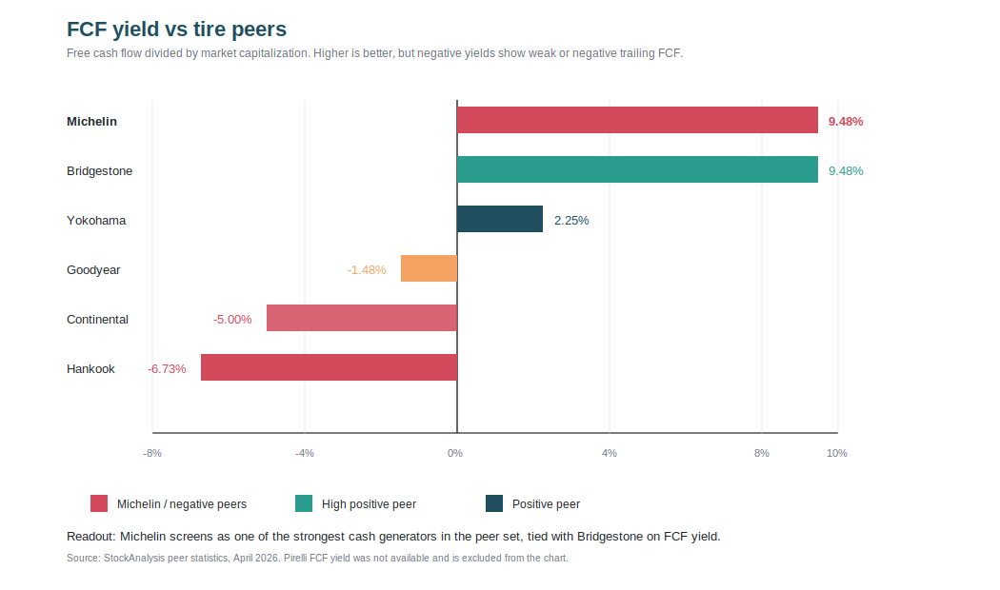

| Société | Rendement FCF | Lecture |
|---|---:|---|
| Michelin | 9.48% | Très fort cash-flow relatif à la capitalisation |
| Bridgestone | 9.48% | Comparable direct, aussi très solide |
| Yokohama Rubber | 2.25% | Positif mais moins attractif |
| Goodyear | -1.48% | FCF négatif / faible, donc moins de flexibilité financière |
| Continental | -5.00% | FCF négatif sur la période observée |
| Hankook Tire | -6.73% | FCF négatif sur la période observée |
| Pirelli | N/A | Donnée non disponible dans StockAnalysis |

### Méthode

- Le **rendement FCF** est le flux de trésorerie disponible divisé par la capitalisation boursière.
- Exemple simple: un rendement FCF de 10% signifie que l'entreprise génère environ EUR 10 de FCF annuel pour EUR 100 de valeur boursière.
- Cette mesure complète les multiples EV/EBITDA et EV/EBIT: elle regarde directement la capacité de cash-flow, pas seulement le résultat comptable.
- Pour Michelin, c'est important parce que la thèse Acheter repose beaucoup sur la qualité du cash-flow, le dividende et les rachats d'actions.

### Résultat

- Michelin ressort à **9.48% de rendement FCF**, au même niveau que Bridgestone et nettement au-dessus de la plupart des comparables disponibles.
- Les rendements FCF négatifs de certains comparables montrent que tous les concurrents ne transforment pas leur résultat opérationnel en trésorerie de façon aussi robuste.
- Cette lecture renforce l'idée que Michelin mérite au moins une valorisation correcte, même si les volumes 2025 ont été faibles.
- Point de prudence: le rendement FCF est une mesure ponctuelle; il peut changer rapidement si le cours de bourse, le BFR ou les capex bougent.

**Message à retenir:** Michelin ne semble pas seulement attractif en DCF; il ressort aussi comme l'un des meilleurs générateurs de trésorerie de son groupe de comparables, ce qui soutient la capacité de dividende et de rachat d'actions.

**Sources:** multiples, marges et rendement FCF des comparables selon StockAnalysis; prévisions Michelin 2026E.

---

# Slide 12 - Valorisation - DCF : WACC et autres hypothèses

**Sous-titre:** WACC central de 8.8% et croissance terminale de 1.5%

## Paramètres WACC

La construction du WACC doit rester lisible comme une suite d'hypothèses: coût des fonds propres, coût de la dette, poids de financement, puis WACC retenu. Ce n'est pas un vrai graphique de performance; c'est une table de paramètres.

| Paramètre | Valeur |
|---|---:|
| Taux sans risque France 10 ans | 3.7% |
| Prime de risque actions Eurozone | 5.8% |
| Beta Michelin | 1.00x |
| Coût des fonds propres | 9.4% |
| Coût dette après impôts | 2.8% |
| Poids fonds propres / dette nette | 90.5% / 9.5% |
| WACC retenu | 8.8% |
| Croissance terminale | 1.5% |

## Proxy ROCE / ROIC vs WACC

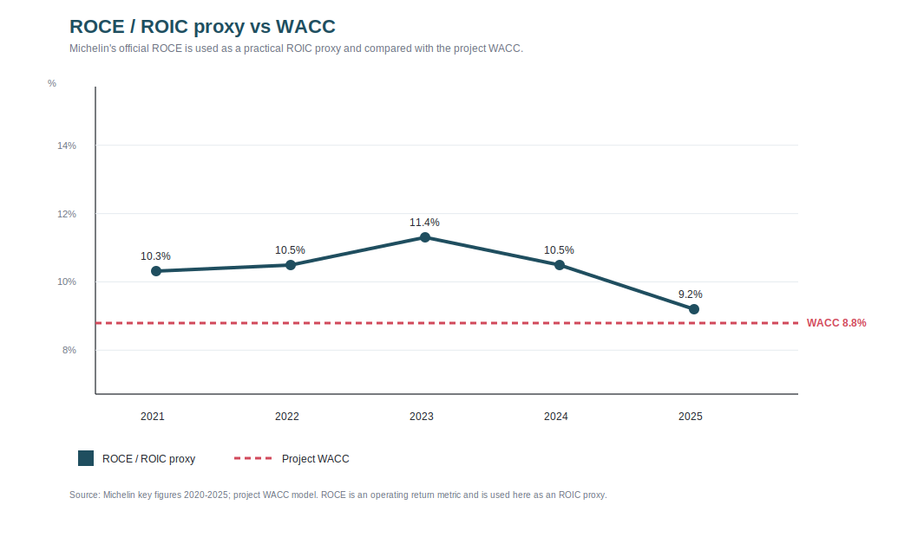

| Année | ROCE Michelin | WACC projet | Ecart ROCE - WACC |
|---|---:|---:|---:|
| 2021 | 10.3% | 8.8% | +1.5 pts |
| 2022 | 10.5% | 8.8% | +1.7 pts |
| 2023 | 11.4% | 8.8% | +2.6 pts |
| 2024 | 10.5% | 8.8% | +1.7 pts |
| 2025 | 9.2% | 8.8% | +0.4 pts |

### Méthode

- Le **ROIC** compare le rendement opérationnel de l'entreprise au capital investi.
- Comme Michelin publie surtout le **ROCE**, on utilise le ROCE comme proxy simple du ROIC.
- La comparaison clé est ROCE vs WACC: si le ROCE est supérieur au WACC, Michelin gagne plus que le coût de son capital et crée de la valeur.
- Si le ROCE passe sous le WACC, la croissance peut détruire de la valeur même si le chiffre d'affaires augmente.

### Résultat

- Michelin reste au-dessus du WACC dans notre lecture 2025: **9.2% de ROCE** contre **8.8% de WACC**.
- L'écart est toutefois devenu très fin: environ **+0.4 point** en 2025, contre +2.6 points en 2023.
- Cela rend la thèse plus précise: l'enjeu n'est pas seulement de faire croître le CA, mais de restaurer les marges et l'utilisation industrielle pour recréer un vrai écart ROCE-WACC.
- Cette analyse est un bon complément au DCF car elle explique pourquoi la marge EBIT est la variable la plus sensible dans le tornado.

**Message à retenir:** Michelin crée encore de la valeur en 2025, mais avec une marge de sécurité plus faible; la reprise de l'écart ROCE-WACC est un indicateur clé à surveiller.

## Hypothèses DCF

- Le DCF utilise l'EBIT SECTOR MICHELIN comme EBIT normalisé, afin de neutraliser les charges non récurrentes.
- Taux d'impôt 26.3%, égal au taux effectif 2025.
- Capex converge vers 7.0% du CA, proche de l'historique Michelin.
- Croissance terminale 1.5%, prudente face à un marché pneus attendu autour de 3.4% CAGR nominal mondial.

**Sources:** CountryEconomy, Kroll, chiffres clés Michelin 2020-2025, StockAnalysis.

---

# Slide 13 - Valorisation - DCF : résultats du DCF

**Sous-titre:** La valeur terminale reste le principal contributeur, comme attendu pour un actif industriel mature

## Indicateurs clés

| Indicateur | Valeur |
|---|---:|
| PV FCFF explicites | EUR 9.1 Md |
| PV valeur terminale | EUR 23.7 Md |
| EV DCF | EUR 32.8 Md |
| EqV DCF (Fonds propres) | EUR 30.5 Md |
| Ratio EV / EqV | 1.08x |
| Valeur / action | EUR 44.5 |
| Potentiel de hausse | 38.0% |

## Détail FCFF

| EURm | 2026E | 2027E | 2028E | 2029E | 2030E |
|---|---:|---:|---:|---:|---:|
| FCFF | 2,079 | 2,226 | 2,371 | 2,501 | 2,584 |
| PV FCFF | 1,910 | 1,880 | 1,840 | 1,783 | 1,693 |

## Commentaires

- Valeur terminale brute: EUR 36.1 Md.
- Valeur des fonds propres (EqV) DCF: EUR 30.5 Md, après déduction d'environ EUR 2.3 Md de dette nette et ajustements.
- Le ratio EV / EqV ressort à 1.08x, répondant à la consigne et confirmant le faible levier.
- Sensibilité centrale WACC/g retrouve EUR 44.5 par action.
- Le résultat est sensible au WACC, d'où la comparaison avec les comparables.

**Source:** modèle Excel DCF.

---

# Slide 14 - Valorisation - DCF : résultats du DCF

**Sous-titre:** Scénarios DCF et sensibilité des principales hypothèses

## Scénario DCF

Le graphique ci-dessous compare les trois scénarios DCF en valeur par action pour rendre l'écart baissier / central / haussier immédiatement lisible.

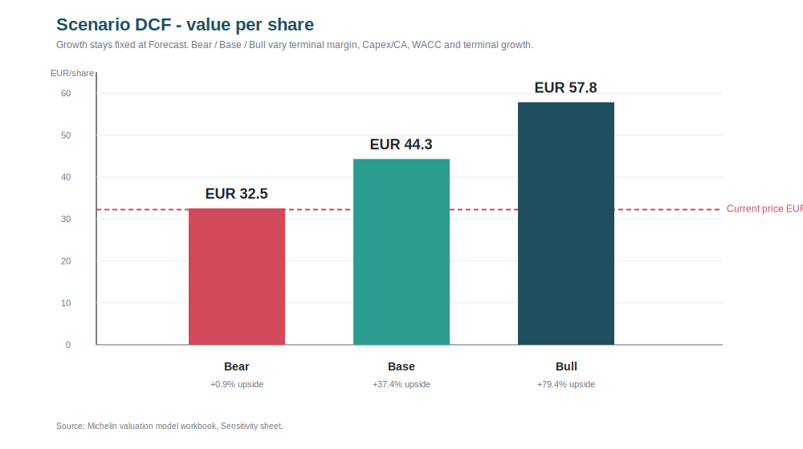

| Scénario | Hypothèse marché | Croissance CA 2026-2030 | Marge EBIT 2030 | WACC | Croissance terminale | Valeur / action | Potentiel vs cours |
|---|---|---:|---:|---:|---:|---:|---:|
| Baissier | OE durablement faible, pression des pneus d'entrée de gamme, mix moins favorable | 0.0% -> 1.5% | 10.5% | 9.3% | 1.0% | EUR 32.0 | -0.8% |
| Central | Reprise graduelle, mix premium positif, pas d'accélération macro agressive | 1.5% -> 2.5% | 12.0% | 8.8% | 1.5% | EUR 44.5 | +38.0% |
| Haussier | Reprise volumes + premiumisation + spécialités et pneus pour véhicules électriques plus forts | 2.5% -> 3.0% | 13.0% | 8.3% | 2.0% | EUR 57.7 | +79.0% |

## Lecture du scénario DCF

- Le **scénario baissier** donne une valeur proche du cours actuel: cela montre que le marché intègre déjà une partie des risques de volume, de devises et de pression prix.
- Le **scénario central** reste nettement au-dessus du cours actuel, surtout grâce à la normalisation des volumes et à une marge EBIT qui remonte progressivement vers 12.0%.
- Le **scénario haussier** montre l'effet d'un meilleur mix premium, d'une croissance plus forte des spécialités et d'une adoption plus favorable des pneus pour SUV / véhicules électriques.
- Ce scénario DCF rend la recommandation plus défendable: même sans scénario haussier, le scénario central offre une marge de sécurité significative.

**Source:** modèle Excel DCF; hypothèses internes construites à partir des tendances Michelin 2025.

## Sensibilité tornado

Le graphique ci-dessous classe les hypothèses selon leur impact sur la valeur DCF afin de montrer les vrais facteurs de sensibilité.

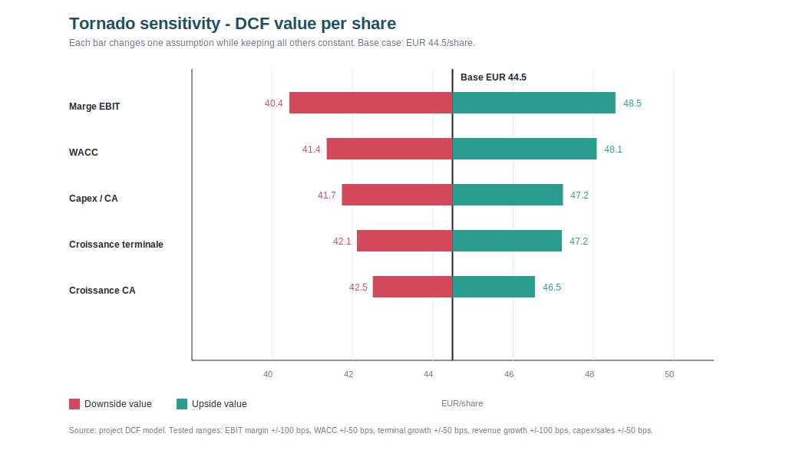

| Variable testée | Hypothèse basse | Hypothèse haute | Valeur basse | Valeur haute | Amplitude |
|---|---|---|---:|---:|---:|
| Marge EBIT | -100 bps chaque année | +100 bps chaque année | EUR 40.4 | EUR 48.5 | EUR 8.1 |
| WACC | +50 bps | -50 bps | EUR 41.4 | EUR 48.1 | EUR 6.7 |
| Capex / CA | +50 bps chaque année | -50 bps chaque année | EUR 41.7 | EUR 47.2 | EUR 5.5 |
| Croissance terminale | -50 bps | +50 bps | EUR 42.1 | EUR 47.2 | EUR 5.1 |
| Croissance CA | -100 bps chaque année | +100 bps chaque année | EUR 42.5 | EUR 46.5 | EUR 4.0 |

## Lecture du tornado

- La variable la plus importante est la **marge EBIT**: cela confirme que le cœur de la thèse d'investissement est la capacité de Michelin à restaurer ses marges après une année 2025 pénalisée par les volumes.
- Le **WACC** est le deuxième facteur le plus sensible: une hausse des taux ou de la prime de risque réduit fortement la valeur actuelle des flux de trésorerie futurs.
- Le **capex / CA** compte aussi, car Michelin est industriel: plus d'investissements absorbent plus de cash-flow disponible.
- La **croissance terminale** influence surtout la valeur terminale, qui représente une grande partie de l'EV DCF.
- La **croissance du CA** est moins sensible que la marge: pour Michelin, la qualité de la croissance et le mix sont plus importants que la croissance brute des volumes.

**Message à retenir:** la recommandation Acheter dépend surtout de la normalisation des marges et du maintien d'un WACC raisonnable; elle n'est pas seulement tirée par une hypothèse agressive de croissance long terme.

---

# Slide 15 - Valorisation - Football field + recommandation d'investissement

**Sous-titre:** Recommandation: Acheter

## Football field

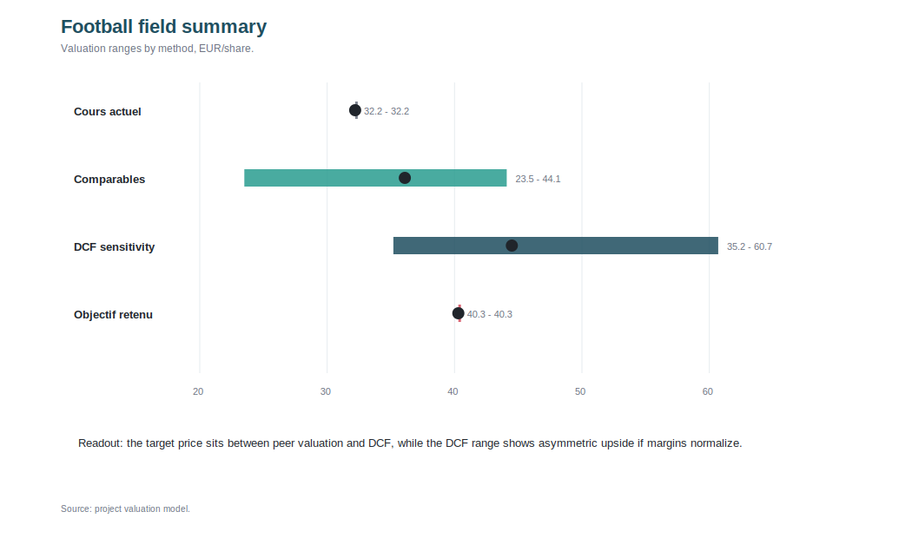

| Méthode | Bas | Central | Haut |
|---|---:|---:|---:|
| Cours actuel | EUR 32.2 | EUR 32.2 | EUR 32.2 |
| Comparables | EUR 23.5 | EUR 36.1 | EUR 44.1 |
| DCF | EUR 35.2 | EUR 44.5 | EUR 60.7 |
| Objectif | EUR 40.3 | EUR 40.3 | EUR 40.3 |

## Indicateurs clés

| Indicateur | Valeur |
|---|---:|
| Objectif central | EUR 40.3 |
| Potentiel cours | 24.9% |
| Rendement dividende | 4.3% |
| Rendement total | 29.2% |

## Recommandation

- Acheter: le rendement total attendu dépasse nettement le coût des fonds propres, avec un bilan solide et un FCF élevé.
- Le potentiel de cours de **24.9%** et le rendement dividende de **4.3%** donnent un rendement total estimé de **29.2%**, ce qui est suffisant pour justifier une recommandation positive.
- La thèse repose principalement sur trois éléments: valorisation DCF au-dessus du cours actuel, génération de FCF élevée et possibilité d'accélération par les rachats d'actions.
- Les comparables montrent que Michelin n'est pas cher versus pairs, mais ils ne justifient qu'un upside relatif limité autour d'une valeur proche de EUR 36/action.
- Le cœur de la recommandation ne vient donc pas d'une forte décote relative contre les pairs, mais d'une sous-valorisation **intrinsèque**: DCF supérieur au cours actuel, normalisation des marges et forte génération de trésorerie dans un secteur aux multiples comprimés.
- À surveiller: volumes OE, pression des pneus d'entrée de gamme, change, matières premières et exécution des rachats d'actions.

**Sources:** modèle Excel, StockAnalysis, résultats annuels Michelin 2025.

---

# Slide 16 - Valorisation - Football field + recommandation d'investissement

**Sous-titre:** Impact potentiel des rachats d'actions sur la valeur par action

## Impact du rachat d'actions

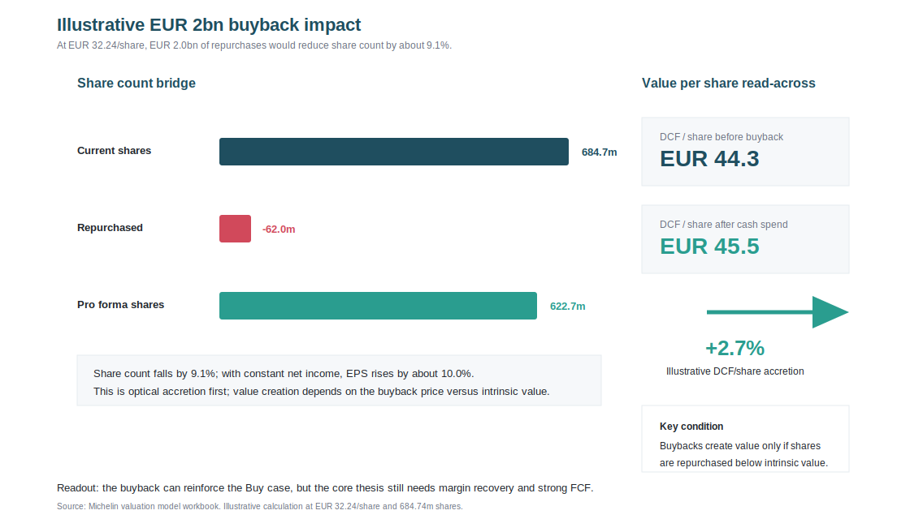

| Élément | Calcul | Résultat |
|---|---|---:|
| Programme de rachat illustré | Hypothèse Michelin 2026-2028 minimum | EUR 2.0 Md |
| Prix de référence | Cours utilisé dans le modèle | EUR 32.24/action |
| Actions rachetées | EUR 2,000m / EUR 32.24 | 62.0m |
| Actions actuelles | Donnée modèle | 684.7m |
| Réduction du nombre d'actions | 62.0m / 684.7m | 9.1% |
| Actions pro forma | 684.7m - 62.0m | 622.7m |
| Accrétion BPA si résultat net constant | 684.7m / 622.7m - 1 | +10.0% |
| DCF/action pro forma après trésorerie utilisée | (EqV DCF - EUR 2.0 Md) / 622.7m | EUR 45.7 |
| Accrétion DCF/action | EUR 45.7 / EUR 44.5 - 1 | +2.7% |

### Méthode

- Michelin a indiqué vouloir retourner environ EUR 4 Md aux actionnaires sur 2026-2028, dont au moins EUR 2 Md de rachats d'actions.
- Le calcul ici est volontairement simple: on suppose que Michelin utilise EUR 2.0 Md pour racheter ses actions au cours de référence de EUR 32.24.
- Le rachat réduit le nombre d'actions: avec moins d'actions, le même résultat net est partagé entre moins d'actionnaires.
- C'est pour cela que le BPA peut monter même si le résultat net total ne change pas.
- Pour le DCF, il faut faire attention: l'entreprise dépense EUR 2.0 Md de trésorerie, donc la valeur des fonds propres baisse aussi de EUR 2.0 Md avant d'être divisée par moins d'actions.

### Interprétation

- L'effet BPA est fort optiquement: environ **+10.0%** si le résultat net reste constant.
- L'effet DCF/action est plus prudent: environ **+2.7%**, car on tient compte de la trésorerie dépensée pour racheter les titres.
- Le rachat crée de la valeur seulement si Michelin rachète ses actions sous la valeur intrinsèque.
- Comme notre DCF central donne EUR 44.5/action contre un cours de référence de EUR 32.24, le rachat est cohérent avec la thèse Acheter.
- Mais il ne faut pas baser toute la recommandation dessus: la création de valeur durable dépend surtout de la marge EBIT, du ROCE au-dessus du WACC et du FCF récurrent.

**Message à retenir:** le rachat d'actions est un accélérateur de valeur par action, pas le moteur principal; il renforce la thèse si Michelin continue à générer du FCF et si le titre reste sous sa valeur intrinsèque.

**Sources:** modèle Excel, StockAnalysis, résultats annuels Michelin 2025.
nir:** le rachat d'actions est un accélérateur de valeur par action, pas le moteur principal; il renforce la thèse si Michelin continue à générer du FCF et si le titre reste sous sa valeur intrinsèque.

**Sources:** modèle Excel, StockAnalysis, résultats annuels Michelin 2025.
